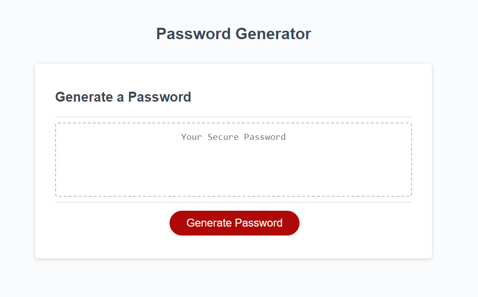

# Password-generator

## Purpose of this challenge
The purpose in doing this challenge was to get myself familiar with using JavaScript concepts. I was tasked with finishing the code for this password generator. To complete this task I utilized Variables, Strings, Arrays, For loops, and conditional statements.

## Image of webpage

## Deployment link

https://dav3ster.github.io/Password-generator/

https://dav3ster.github.io/
